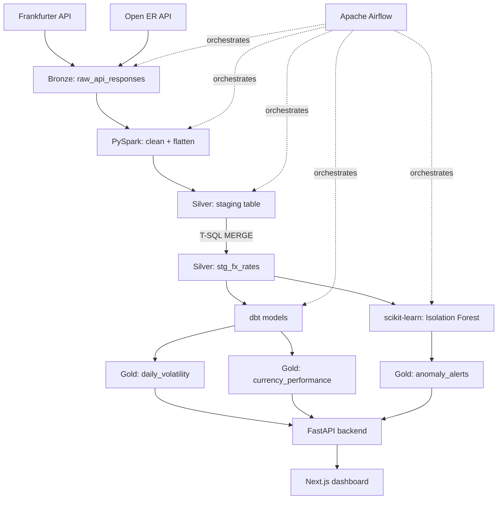

# FX Rate Analytics Pipeline

An end-to-end foreign exchange analytics pipeline that collects live currency exchange rates from two independent public APIs and transforms them into actionable analytics. The project follows a Bronze-Silver-Gold medallion architecture using Microsoft SQL Server, where raw API responses are stored in the Bronze layer, cleaned and standardized data is processed in the Silver layer, and the Gold layer provides business-ready metrics such as rolling volatility, month-over-month performance, and anomaly alerts. The pipeline uses Python, PySpark, dbt, Apache Airflow, and scikit-learn for ingestion, transformation, orchestration, and machine learning. An Isolation Forest model identifies unusual FX rate movements, while a FastAPI backend and Next.js dashboard provide an interactive way to explore exchange rates, volatility, and detected anomalies. The entire workflow is designed with idempotent processing and reliable data loading in mind, allowing pipeline steps to be safely re-run without creating duplicate records.

## Architecture



**Medallion layers:**
- **Bronze** — raw, untouched API responses (audit trail)
- **Silver** — cleaned, standardized rates, one consistent schema across both source APIs
- **Gold** — business-ready analytics: rolling volatility, month-over-month performance, anomaly alerts

## Tech Stack

| Layer | Technology | Purpose |
|---|---|---|
| Ingestion | Python, Frankfurter API, Open Exchange Rates (Open ER) API | Fetch daily FX rates from two independent free sources |
| Storage | Microsoft SQL Server (T-SQL) | Bronze/Silver/Gold medallion data warehouse |
| Batch Processing | Apache Spark (PySpark) | Distributed cleaning/flattening of heterogeneous JSON schemas |
| Transformation | dbt (dbt-sqlserver) | Version-controlled SQL models, automated data tests |
| Machine Learning | scikit-learn (Isolation Forest) | Unsupervised anomaly detection on FX rate movements |
| Orchestration | Apache Airflow (via WSL2) | Daily end-to-end pipeline scheduling |
| API | FastAPI | Serves Gold-layer analytics as JSON |
| Frontend | Next.js (App Router), Recharts, Tailwind CSS | Interactive analytics dashboard |
| CI/CD | GitHub Actions | Automated Python linting + dbt model validation on every push |
| IaC | Terraform, AWS S3 | Cloud storage provisioning |

## Project Structure

```
fx-rate-analytics-pipeline/
├── .github/workflows/       # CI: flake8 lint + dbt parse check
├── airflow/dags/            # Airflow DAG (run via WSL2)
├── backend/                 # FastAPI: rates/volatility/anomalies endpoints
├── dashboard/               # Next.js analytics dashboard
├── dbt_fx/                  # dbt models: Silver clean view, Gold tables + tests
├── ml/                      # Isolation Forest anomaly detection
├── python_app/              # Fetch (Frankfurter + Open ER) and load scripts
├── spark                    # PySpark batch transform + T-SQL merge
├── sql/                     # Schema and table DDL scripts
├── terraform/               # AWS S3 bucket provisioning
└── data/bronze/             # Local raw JSON landing zone (gitignored)
```

## Key Design Decisions & Challenges Overcome

- **Idempotency everywhere.** Every load step (Python inserts, Spark JDBC writes, dbt models) is designed to be safely re-run without creating duplicates — using `MERGE` statements, unique constraints, and `TRUNCATE`+reload patterns depending on the layer's semantics.
- **Staging-then-merge for Spark writes.** Spark's JDBC writer only supports overwrite/append, not upsert — so Spark writes to a staging table, and a T-SQL `MERGE` handles the actual upsert into Silver, combining Spark's batch-processing strength with SQL's transactional guarantees.
- **Portable database connections.** Early in the project, Docker Desktop's networking proved unreliable in this environment (see below), so the pipeline runs natively on Windows with a fallback to WSL2 for Airflow (which has no native Windows support). This required standardizing on SQL Server Authentication (rather than Windows Integrated Auth) across all pipeline components, since it works identically whether a script runs on native Windows or inside WSL2 — a real lesson in why environment-portable configuration matters.
- **Feature engineering for anomaly detection.** Rather than feed raw exchange rates into Isolation Forest, the model uses each currency pair's deviation from its own rolling 7-day average — since a "normal" rate for one pair may be a wild outlier for another. A separate model is trained per currency pair for the same reason.
- **Troubleshooting real infrastructure issues.** Diagnosed and resolved a Debian package signing key trust failure (`apt-key` deprecation) when containerizing a Python/ODBC image, and a Docker Desktop CDN/DNS resolution failure — ultimately deciding to run key components natively rather than over-invest in fighting a flaky local Docker setup, a practical trade-off under time constraints.

## Getting Started

**Prerequisites:** Python 3.11+, Java 17 (for PySpark), Node.js 18+, SQL Server (local or remote), WSL2 with Ubuntu (for Airflow).

1. Clone the repo and create a `.env` file with `MSSQL_SA_PASSWORD` and API config (see `.env.example`)
2. Run `sql/create_schemas.sql` through `sql/create_staging_table.sql` in SSMS to set up the database
3. Set up the Python virtual environments (`python_app/venv`, `dbt_env`) and install each `requirements.txt`
4. Run the pipeline manually end-to-end: `fetch_fx_data.py` → `load_to_mssql.py` → `transform_bronze_to_silver.py` → `merge_staging_to_silver.py` → `dbt run && dbt test` → `detect_anomalies.py`
5. Start the API (`uvicorn main:app --port 8000`) and dashboard (`npm run dev`) to view results
6. (Optional) Set up Airflow in WSL2 and trigger `fx_ingestion_dag` to run the full pipeline on a schedule