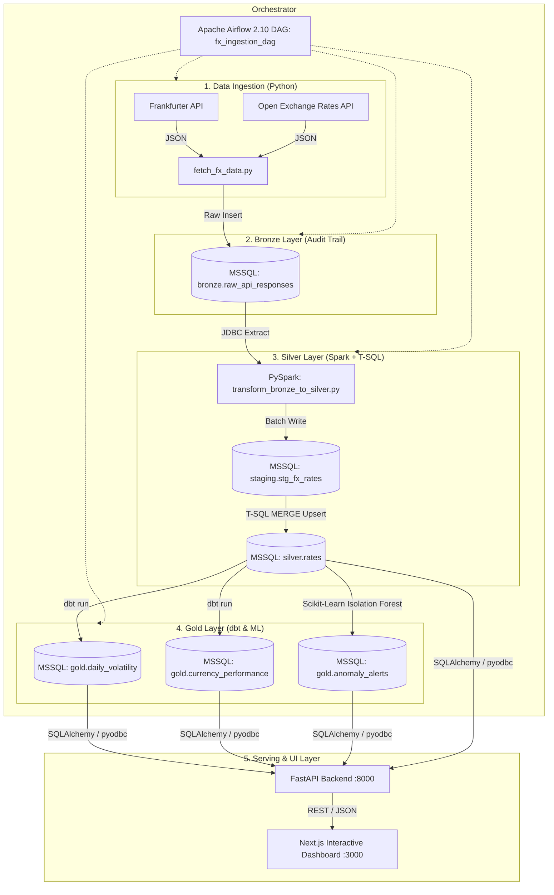
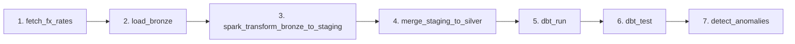

# FX Rate Analytics Pipeline

An end-to-end foreign exchange data engineering and analytics platform that ingests, cleans, transforms, models, detects anomalies, and visualizes global currency exchange rates. 

Built with a **Bronze-Silver-Gold Medallion Architecture** using **Microsoft SQL Server**, **Apache Spark (PySpark)**, **dbt (dbt-sqlserver)**, **Apache Airflow**, **Scikit-Learn (Isolation Forest)**, **FastAPI**, and **Next.js**.

---

## Table of Contents
- [Architecture Overview](#architecture-overview)
- [Medallion Data Warehouse Layers](#medallion-data-warehouse-layers)
- [Tech Stack](#tech-stack)
- [Project Directory Structure](#project-directory-structure)
- [Quick Start Guide (Docker Compose)](#quick-start-guide-docker-compose)
- [Step-by-Step Instructions: How to Run Everything](#step-by-step-instructions-how-to-run-everything)
- [How to Update Data Day-by-Day (Daily Operations)](#how-to-update-data-day-by-day-daily-operations)
- [API Documentation (FastAPI)](#api-documentation-fastapi)
- [Interactive Dashboard Features (Next.js)](#interactive-dashboard-features-nextjs)
- [Resilience & Key Engineering Decisions](#resilience--key-engineering-decisions)

---

## Architecture Overview



---

## Medallion Data Warehouse Layers

| Layer | Table / View | Description | Key Transformations |
|---|---|---|---|
| **Bronze** | `bronze.raw_api_responses` | Untouched raw JSON payloads from APIs. Serves as an immutable audit trail. | Schema-on-read, payload timestamping. |
| **Staging** | `staging.stg_fx_rates` | Transient landing table for Spark writes. | Truncated before each Spark batch load. |
| **Silver** | `silver.rates` | Standardized, deduplicated, and unified exchange rates. | Heterogeneous JSON flattening, currency normalization, idempotent `MERGE` upsert. |
| **Gold** | `gold.daily_volatility` | Business-ready analytical mart tracking 7-day rolling averages and volatility %. | Window functions (`AVG() OVER`, `STDEV() OVER`), daily percentage swings. |
| **Gold** | `gold.currency_performance` | Aggregated monthly performance mart with Month-over-Month (MoM) growth metrics. | Monthly aggregation (`DATEFROMPARTS`), `LAG()` window function for MoM change %. |
| **Gold** | `gold.anomaly_alerts` | Machine learning outlier radar. | Unsupervised Isolation Forest deviation scoring on rolling price deltas. |

---

## Tech Stack

- **Storage & Data Warehouse:** Microsoft SQL Server 2022 (T-SQL, Dockerized)
- **Batch Processing:** Apache Spark (PySpark 3.5 + Microsoft JDBC Driver)
- **Data Transformation & Testing:** dbt Core (`dbt-sqlserver` 1.11)
- **Pipeline Orchestration:** Apache Airflow 2.10 (with custom Docker setup)
- **Machine Learning:** Python `scikit-learn` (Isolation Forest anomaly detection)
- **API Backend:** FastAPI, Uvicorn, Pydantic v2, SQLAlchemy, ODBC Driver 18
- **Frontend Dashboard:** Next.js 14 (App Router), React, Tailwind CSS, Recharts, Lucide Icons
- **Infrastructure & Containerization:** Docker Compose, Multi-stage Dockerfiles, Terraform

---

## Project Directory Structure

```
fx-rate-analytics-pipeline/
├── airflow/
│   ├── dags/
│   │   └── fx_ingestion_dag.py     # 7-step orchestrated pipeline DAG
│   └── Dockerfile                  # Airflow container with Spark, dbt-sqlserver, Java 17
├── backend/
│   ├── main.py                     # FastAPI server (/api/rates, /api/volatility, /api/performance, /api/anomalies)
│   ├── Dockerfile                  # Python 3.11 + ODBC Driver 18 container
│   └── requirements.txt
├── dashboard/
│   ├── app/
│   │   ├── layout.tsx              # Root HTML & metadata
│   │   ├── page.tsx                # Server-Side Rendered (SSR) data fetcher
│   │   └── globals.css             # Tailwind CSS tokens
│   ├── components/
│   │   └── Dashboard.tsx           # Full interactive financial intelligence cockpit UI
│   ├── countryCodes.json           # ISO country metadata & flag mapping
│   └── Dockerfile                  # Multi-stage Next.js Node 20 runner
├── dbt_fx/
│   ├── models/
│   │   ├── silver/                 # Silver views & cleaning models
│   │   └── gold/                   # Gold marts: daily_volatility, currency_performance
│   └── dbt_project.yml
├── ml/
│   ├── detect_anomalies.py         # Isolation Forest ML pipeline
│   └── requirements.txt
├── python_app/
│   ├── fetch_fx_data.py            # Extracts data from Frankfurter & Open Exchange Rates APIs
│   ├── load_to_mssql.py            # Bronze raw JSON ingestion script
│   └── requirements.txt
├── spark/
│   ├── jobs/
│   │   └── transform_bronze_to_silver.py  # PySpark ETL batch job
│   └── scripts/
│       └── merge_staging_to_silver.py     # T-SQL idempotent MERGE script
├── sql/
│   ├── init_db.py                  # Automated database initialization script
│   ├── create_schemas.sql          # Schema definitions (bronze, silver, gold, staging)
│   ├── create_tables.sql           # Idempotent DDL definitions
│   └── create_staging_table.sql    # Spark staging table definition
├── docker-compose.yml              # Multi-container orchestration (mssql, airflow, backend, dashboard)
├── .env.example                    # Environment variable template
└── README.md                       # Documentation
```

---

## Quick Start Guide (Docker Compose)

### 1. Prerequisites
- [Docker Desktop](https://www.docker.com/products/docker-desktop/) (v24+ recommended) with WSL2 enabled.
- Git.

### 2. Configure Environment Variables
Copy `.env.example` to `.env` in the project root:

```bash
cp .env.example .env
```

Ensure your `.env` contains the required database passwords and API keys:

```env
MSSQL_SERVER=mssql
MSSQL_DATABASE=fx_analytics
MSSQL_USER=sa
MSSQL_SA_PASSWORD=YourStrong@Password123
OPEN_EXCHANGE_RATES_APP_ID=your_api_key_here
```

---

## Step-by-Step Instructions: How to Run Everything

### Step 1: Start Database & Support Containers
Build and spin up the complete Docker Compose stack:

```powershell
docker compose up -d
```

Check the status of all 4 microservices:
```powershell
docker compose ps
```

| Container | Service | Port | Description |
|---|---|---|---|
| `fx_mssql` | MS SQL Server 2022 | `1433` | Database engine with Bronze/Silver/Gold schemas |
| `fx_airflow` | Apache Airflow 2.10 | `8080` | Pipeline orchestrator (runs scheduler + webserver) |
| `fx_backend` | FastAPI REST API | `8000` | Analytics query API server |
| `fx_dashboard` | Next.js App | `3000` | Real-time interactive UI |

---

### Step 2: Open the Airflow Web UI & Run the Pipeline
1. Open your browser and navigate to **[http://localhost:8080](http://localhost:8080)**.
2. Log in using the default credentials:
   - **Username:** `airflow`
   - **Password:** `airflow`
3. Locate the DAG **`fx_ingestion_dag`**.
4. If paused, toggle the switch to **Active**, then click the **Trigger DAG (▶)** button on the top right.

The DAG will automatically execute all 7 pipeline tasks in sequence:



1. **`fetch_fx_rates`**: Fetches latest spot exchange rates from both Frankfurter and Open Exchange Rates APIs.
2. **`load_bronze`**: Loads raw JSON audit logs into `bronze.raw_api_responses`.
3. **`spark_transform_bronze_to_staging`**: PySpark reads the bronze JSON, unifies heterogeneous structures, flattens currency arrays, and bulk-writes to `staging.stg_fx_rates`.
4. **`merge_staging_to_silver`**: Executes a T-SQL `MERGE` to idempotently upsert new records into `silver.rates`.
5. **`dbt_run`**: Executes dbt models to materialize `gold.daily_volatility` and `gold.currency_performance`.
6. **`dbt_test`**: Runs automated dbt data validation tests (not-null, unique constraints, referential checks).
7. **`detect_anomalies`**: Fits Scikit-Learn Isolation Forest per currency pair and writes flagged outliers to `gold.anomaly_alerts`.

---

### Step 3: Access the Interactive Dashboard & API
- **Interactive Analytics Dashboard:** [http://localhost:3000](http://localhost:3000)
- **FastAPI Interactive Docs (Swagger):** [http://localhost:8000/docs](http://localhost:8000/docs)
- **Airflow DAG Manager:** [http://localhost:8080](http://localhost:8080)

---

## How to Update Data Day-by-Day (Daily Operations)

The pipeline is engineered for **automated daily incremental operation** as well as **on-demand ad-hoc runs**.

### Method A: Automated Daily Cron (Default)
The Airflow DAG `fx_ingestion_dag` is configured with a daily schedule (`@daily` / `schedule_interval="@daily"`).
- Every day at midnight (UTC), Airflow will automatically trigger the ingestion job.
- The pipeline will fetch the latest daily rates, run Spark transformations, perform the Silver `MERGE`, recalculate dbt Gold marts, run the ML anomaly detector, and make new data instantly available in the dashboard.

### Method B: Manual Trigger via Airflow UI or CLI
To force an immediate sync at any time:

**Via Airflow UI:**
1. Go to [http://localhost:8080](http://localhost:8080).
2. Click the **Play button (▶ Trigger DAG)** next to `fx_ingestion_dag`.

**Via Airflow CLI (inside container):**
```powershell
docker compose exec airflow airflow dags trigger fx_ingestion_dag
```

### Method C: Running Individual Pipeline Stages Manually (CLI / Debugging)
If you wish to test or run individual steps without Airflow:

```powershell
# 1. Fetch latest FX rates from APIs
docker compose exec airflow python /opt/airflow/project/python_app/fetch_fx_data.py

# 2. Ingest raw JSON into Bronze
docker compose exec airflow python /opt/airflow/project/python_app/load_to_mssql.py

# 3. Transform Bronze to Staging via PySpark
docker compose exec airflow /opt/airflow/project/spark/jobs/run_spark.sh

# 4. Merge Staging into Silver
docker compose exec airflow python /opt/airflow/project/spark/scripts/merge_staging_to_silver.py

# 5. Run dbt Gold Models & Tests
docker compose exec airflow bash -c "cd /opt/airflow/project/dbt_fx && dbt run --profiles-dir . && dbt test --profiles-dir ."

# 6. Run Isolation Forest ML Anomaly Detection
docker compose exec airflow python /opt/airflow/project/ml/detect_anomalies.py
```

---

## API Documentation (FastAPI)

FastAPI serves Gold-layer metrics and active spot rates via high-performance endpoints with Pydantic v2 schemas:

| Endpoint | Method | Parameters | Description |
|---|---|---|---|
| `/api/rates` | `GET` | — | Returns latest spot rates for all tracked currency pairs. |
| `/api/volatility` | `GET` | `base_currency`, `target_currency`, `days` | Returns historical daily spot rates, 7-day rolling average, and volatility % for the requested window (7d, 30d, 90d, 365d). |
| `/api/performance` | `GET` | `base_currency` (optional) | Returns historical monthly average rates and Month-over-Month (MoM) % changes from `gold.currency_performance`. |
| `/api/anomalies` | `GET` | `limit` (default: 50) | Returns outlier records flagged by the Isolation Forest model, sorted by anomaly score. |
| `/api/summary` | `GET` | — | Returns overall pipeline summary metrics (total pairs, latest sync date, anomaly count, pair list). |

---

## Interactive Dashboard Features (Next.js)

The frontend is a financial intelligence terminal equipped with real-time interactivity:

1. **Quick Currency Selector (6×2 Grid with Country & Search)**:
   - Displays major leading economies (Eurozone, UK, Japan, Canada, Australia, Switzerland, China, India, Singapore, New Zealand, Brazil, South Africa) in a 6-per-row, 2-row layout.
   - Powered by [`countryCodes.json`](file:///e:/Project/fx-rate-analytics-pipeline/fx-rate-analytics-pipeline/dashboard/countryCodes.json) with dynamic ISO flag emojis and country names.
   - Built-in instant search bar to find and switch to any global currency on the fly.
2. **Glowing Gradient Area Chart & Moving Averages**:
   - Interactive Recharts visualization with 7-day Simple Moving Average line and responsive tooltip.
   - Dual-mode visualization toggle between Area Chart and Composed Bar + Moving Average view.
   - Dynamic timeframe buttons (`7D`, `30D`, `90D`, `1Y`).
3. **dbt Gold Monthly Performance Mart Table**:
   - Displays aggregated monthly averages with color-coded MoM % delta badges (Emerald for positive, Rose for negative).
4. **Live FX Currency Converter**:
   - Two-way calculator converting USD amounts into any tracked world currency using verified spot rates.
5. **AI Anomaly & Outlier Radar**:
   - Visual outlier cards with severity badges (`High`, `Medium`, `Low`) based on Isolation Forest anomaly scores.
6. **Active Currency Pairs Directory & One-Click CSV Export**:
   - Searchable and sortable directory table of all active currency pairs.
   - One-click CSV export generating a downloadable spreadsheet of the active chart data.

---

## Resilience & Key Engineering Decisions

- **Idempotent Data Ingestion Everywhere:** All insertion points use `IF NOT EXISTS` or SQL `MERGE` statements. Re-running the pipeline on the same day will safely update existing records without creating duplicate entries.
- **Spark Staging-then-Merge Pattern:** Because PySpark's JDBC writer natively supports `append` or `overwrite`, Spark writes batch results to a transient `staging.stg_fx_rates` table, followed by an atomic T-SQL `MERGE` into `silver.rates`.
- **Domain-Specific Feature Engineering for ML:** Rather than feeding raw exchange rates to Isolation Forest, the model evaluates each pair's percentage deviation from its rolling 7-day baseline, preventing standard high-value pairs (like USD/JPY) from skewing outlier detection for low-value pairs (like USD/EUR).
- **Environment-Portable Configuration:** All microservices use standardized environment variables (`.env`) and SQL Server Authentication, making execution completely seamless across Docker, native Windows, and WSL2.

---